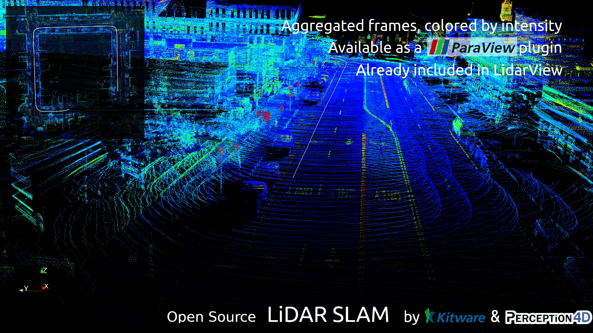
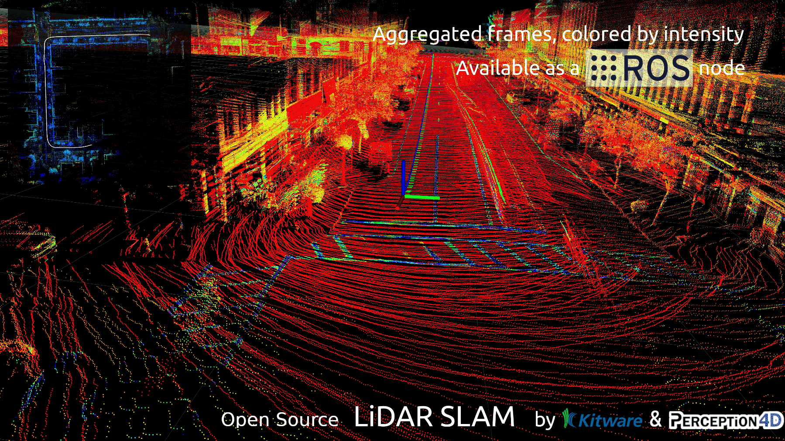

# Kiware LiDAR SLAM


|||
|-------|-------|
|SLAM in LidarView|SLAM in ROS|

# LiDAR SLAM

- [LiDAR SLAM](#lidar-slam)
  - [Introduction and contents](#introduction-and-contents)
  - [Core SLAM lib](#core-slam-lib)
    - [Dependencies](#dependencies)
    - [Installation](#installation)
      - [With system dependencies](#with-system-dependencies)
      - [With local dependencies](#with-local-dependencies)
      - [With Superbuild](#with-superbuild)
  - [ROS wrapping](#ros-wrapping)
  - [ROS2 wrapping on Linux](#ros2-wrapping-on-linux)
    - [Dependencies](#dependencies-1)
    - [Installation](#installation-1)
      - [With system dependencies](#with-system-dependencies-2)
      - [With local dependencies](#with-local-dependencies-2)
      - [With Superbuild](#with-superbuild-2)
    - [Live usage](#live-usage-1)
  - [ROS2 wrapping on Windows 10](#ros2-wrapping-on-windows-10)
    - [Install dependencies](#install-dependencies)
      - [Install ROS2 and slam dependencies](#install-ros2-and-slam-dependencies)
      - [Install pcl-conversions](#install-pcl-conversions)
    - [Install SLAM package](#install-slam-package)
  - [ParaView wrapping](#paraview-wrapping)
    - [Dependencies](#dependencies-2)
    - [Installation](#installation-2)
    - [Usage](#usage)
    - [Use SLAM in LidarView](#use-slam-in-lidarview)

## Introduction and contents

This repository contains a SLAM system developed by Kitware, primarily based on 3D LiDAR. It also supports external sensors such as INS, IMU, GPS, and cameras to enhance SLAM accurancy. Paraview and ROS1 / ROS2 wrappers are provided for easier integration.

**/!\ Note: The support for ROS1 package is available in the [ROS1/SlamRos1Wrapping](https://gitlab.kitware.com/keu-computervision/slam/-/tree/ROS1/SlamRos1Wrapping?ref_type=heads) branch. Since ROS Noetic will reach end-of-life in May 2025, and the branch for ROS1 will no longer be maintained after that date.**

It has been successfully tested on data from several common LiDAR sensors:
- Velodyne (VLP-16, VLP-32c, HDL-32, HDL-64, VLS-128)
- Ouster (OS0/1/2-32/64/128)
- RoboSense (RS-LiDAR-16 RS-LiDAR-32)
- Hesai (PandarXT16, PandarXT32, Pandar128)
- Livox (mid 360)

Have a look at our [SLAM demo video](https://vimeo.com/524848891)!

This codebase is under active development. If you're interested by new features, new sensors' support or any project that could be using this SLAM, do not hesitate to contact us at kitware@kitware.fr.

Repo contents :
- `slam_lib/`: core *LidarSlam* library containing SLAM algorithm and other utilities.
- `superbuild/`: Cross-platform installer.
- `ros_wrapping/`: ROS packages to enable SLAM use on a ROS system. Please refer to [ROS1/SlamRos1Wrapping](https://gitlab.kitware.com/keu-computervision/slam/-/tree/ROS1/SlamRos1Wrapping?ref_type=heads) branch.
- `ros2_wrapping/`: ROS2 packages to enable SLAM use on a ROS2 system.
- `paraview_wrapping/`: ParaView plugin to enable SLAM use with ParaView/LidarView.
- `ci/`: continuous integration files to automatically build and check *LidarSlam* lib.
- `CMakeLists.txt`: *CMakeLists* used to call to build core *LidarSlam* lib and *paraview_wrapping*.

## Core SLAM lib

### Dependencies

Dependencies are listed in the table below along with the version used during development and testing. Minimum required versions have not been determined yet.

| Dependency | Minimum tested Version |
| :--------: | :--------------------: |
| Eigen3     | 3.3.4                  |
| Ceres      | 1.13.0                 |
| PCL        | 1.8                    |
| nanoflann  | 1.3.0                  |
| g2o*       | 1.0.0 (master)         |
| OpenMP*    | 2.0                    |
| gtsam*     | 4.2a8                  |
| OpenCV*    | 4.5.4                  |
| TEASER++*  | 2.0                    |

(*) optional dependencies :

- If G2O is not available (or disabled), *LidarSlam* lib will still be compiled, but without pose graph optimization features.
- If GTSAM is not available (or disabled), *LidarSlam* lib will still be compiled, but without IMU processing features.
- If OpenCV is not available (or disabled), *LidarSlam* lib will still be compiled, but without camera features.
- If TEASER++ is not available (or disabled), *LidarSlam* lib will still be compiled, but without loop closure detection features. Additionally, the loop closure detection feature has not been supported yet in the ROS2 wrapper.
- If OpenMP is available, it is possible to use multi-threading to run some SLAM steps in parallel and achieve higher processing speed.

**/!\ Warning** Make sure to compile/install G2O with the same Ceres version as the one used in the SLAM compilation. To do so, disable the feature [G2O_USE_VENDORED_CERES](https://github.com/RainerKuemmerle/g2o/blob/master/CMakeLists.txt) during G2O compilation and link against the right version of Ceres.

### Installation

The *LidarSlam* lib has been tested on Linux, Windows and OS X.

First, go to your workspace directory and clone the SLAM repository.
```bash
git clone https://gitlab.kitware.com/keu-computervision/slam.git src --recursive
```

#### With system dependencies

To build only *LidarSlam* lib using your system dependencies, run :

```bash
cmake -E make_directory build && cd build
cmake ../src -DCMAKE_BUILD_TYPE=Release
cmake --build . -j
```

**NOTE**: On Windows, if some dependencies were installed using vcpkg, the variable `CMAKE_TOOLCHAIN_FILE` must be specified :
```
cmake ../src -DCMAKE_BUILD_TYPE=Release -DCMAKE_TOOLCHAIN_FILE=[vcpkg-install]/scripts/buildsystems/vcpkg.cmake
```

#### With local dependencies

You can link to the local libraries you have installed by adding cmake flags. Notably with Ceres and G2O:
```bash
cmake ../src -DCMAKE_BUILD_TYPE=Release -DCeres_DIR=path/to/CeresConfig.cmake -Dg2o_DIR=path/to/g2oConfig.cmake
```

#### With Superbuild

In your workspace, run:

```bash
cmake -E make_directory build && cd build
cmake ../src/slam-superbuild -DCMAKE_BUILD_TYPE=Release
cmake --build . -j
```

**NOTE**: By default in the superbuild, mandatory dependencies are installed but optional dependencies are not. You can decide which dependencies to install with the superbuild using the options **INSTALL_XX**. For example, to not build *PCL*:
```bash
cmake ../src/slam-superbuild -DCMAKE_BUILD_TYPE=Release -DINSTALL_PCL=OFF
```

Note that installing and enabling an optional dependency is not the same. If you want to install and enable the use of an optional dependency you need to switch two variables to ON: **INSTALL_XX** and **ENABLE_XX**.

_Example:_ to install and enable *GTSAM* :
```bash
cmake ../src/slam-superbuild -DCMAKE_BUILD_TYPE=Release -DINSTALL_GTSAM=ON -DENABLE_GTSAM=ON
```

More documentation about the superbuild can be found [here](https://gitlab.kitware.com/keu-computervision/slam-superbuild).

## ROS wrapping

The ROS1 wrapping has been tested on Linux only. Please refer to [ROS1/SlamRos1Wrapping](https://gitlab.kitware.com/keu-computervision/slam/-/tree/ROS1/SlamRos1Wrapping?ref_type=heads) branch for more details.

## ROS2 wrapping on Linux

You can download the ROS2 package in [the artifacts of the CI pipeline](https://gitlab.kitware.com/keu-computervision/slam/-/pipelines) for any version.

A docker image can be found in [the artifacts of master branch](https://gitlab.kitware.com/keu-computervision/slam/-/pipelines?page=1&scope=all&ref=master) if it has been triggered manually.
You can load and run this image with :

```
docker load -i slam_image.tar
docker run -it --rm slam:<CURRENT_COMMIT> bash
```

replacing CURRENT_COMMIT with the image commit sha.

### Dependencies

Ensure all *LidarSlam* dependencies are respected (see next sections to do so). Specific ROS packages dependencies are listed in the table below along with the version used during development and testing.

| Dependency      | Tested Versions | Install (`sudo apt-get install <pkg>`)                                             | status    |
|:---------------:|:---------------:|:----------------------------------------------------------------------------------:|:---------:|
| ROS             | humble/iron     | `ros-$ROS_DISTRO-desktop-full`                                                     | mandatory |
| pcl-ros         | 1.7.4           | `ros-$ROS_DISTRO-pcl-ros`                                                          | mandatory |
| apriltag        | 3.2.0           | `ros-$ROS_DISTRO-apriltag`                                                         | optional  |
| g2o             | 5.3             | `ros-$ROS_DISTRO-libg2o`                                                           | optional  |

LiDAR drivers may also need to be installed to interpret LiDAR packets and convert them into raw point clouds. Our ROS wrapper includes a helper package that transforms raw point clouds from common LiDAR drivers into the format expected by the SLAM algorithm. For more details, refer to the [ros2_wrapping/lidar_conversions/README.md](ros2_wrapping/lidar_conversions/README.md) for more details.

_Example:_ velodyne driver installation

Install the updated Velodyne driver using:
```
sudo apt install ros-$ROS_DISTRO-velodyne`
```

### Installation

Clone this git repo directly into your colcon workspace (referred to as **colcon_ws** in the guide), under the src directory:

 ```bash
 cmake -E make_directory colcon_ws && cd colcon_ws
 git clone https://gitlab.kitware.com/keu-computervision/slam.git src/slam --recursive
```

The next sections describe how to install the required dependencies (both mandatory and optional) and to build the SLAM packages with the necessary features.

**Prerequisite:** Install pcl-ros
Before proceeding, ensure pcl-ros is installed. You can install it using apt as follows:
 `sudo apt-get install -y ros-$ROS_VERSION-pcl-ros`

**NOTE**: Boost, g2o, Eigen, Ceres and PCL should be already installed from previous setup steps.

#### With system dependencies

This method applies if you have installed all required dependencies on your system, such as through package managers like `apt`.

**NOTE**: The only missing dependency at this point should be nanoflann. You can install it using:
 `sudo apt-get install -y libnanoflann-dev`.

##### BUilding the SLAM packages
Run the following command to build the ROS2 SLAM packages:
`colcon build --base-paths src/slam/ros2_wrapping`
or for optimized performance (highly recommended when using Eigen), use:
`colcon build --base-paths src/slam/ros2_wrapping --cmake-args -DCMAKE_BUILD_TYPE=Release`
The variable base_paths must point to the path of the ros2_wrapping folder.

By default, this will build the *LidarSlam* library before ROS2 packages. If you prefer to use your system LidarSlam, set `BUILD_SLAM_LIB` to `OFF`:
`colcon build --base-paths src/slam/ros2_wrapping --cmake-args -DCMAKE_BUILD_TYPE=Release -DBUILD_SLAM_LIB=OFF`

#### With local dependencies

If you have built and installed some dependencies locally, you can specify their paths when building the SLAM library using CMake.

_Example:_ Using local Ceres and g2o

To use locally installed versions of Ceres and g2o, pass their respective paths to CMake:
 ```bash
 colcon build --base-paths src/slam/ros2_wrapping --cmake-args -DCMAKE_BUILD_TYPE=Release -DCeres_DIR=path/to/CeresConfig.cmake -Dg2o_DIR=path/to/g2oConfig.cmake
 ```

_Example:_ Using a local version of LidarSlam

If you want to use a local version of LidarSlam library, you can prevent the package from building it and instead provide the path to its CMake configuration file:

 ```bash
 colcon build --base-paths src/slam/ros2_wrapping --cmake-args -DCMAKE_BUILD_TYPE=Release -DBUILD_SLAM_LIB=OFF -DLidarSlam_DIR=path/to/LidarSlam.cmake
```

#### With Superbuild

If you are missing dependencies and prefer not to manually install them, you can use the [superbuild](https://gitlab.kitware.com/keu-computervision/slam-superbuild/). The superbuild automates the process of downloading, building, and installing all necessary dependencies locally, making it easier to build the SLAM packages afterward. Superbuild supports both mandatory and optional dependencies, and you can select which ones to install using the `INSTALL_XX` variables (e.g., INSTALL_PCL=OFF for PCL).

**WARNING** You cannot use PCL from the superbuild, as it would cause runtime conflicts with the system version.

**WARNING** The superbuild must be installed outside of colcon workspace.

_Full installation with superbuild example_ :
 ```bash
 # Clone project
 git clone https://gitlab.kitware.com/keu-computervision/slam.git colcon_ws/src/slam --recursive

 # Build Superbuild to install dependencies locally
 cmake -E make_directory SB-build && cd SB-build
 cmake ../colcon_ws/src/slam/slam-superbuild -GNinja -DCMAKE_BUILD_TYPE=Release -DINSTALL_PCL=OFF
 cmake --build . -j

 # Build the SLAM ROS2 package pointing to the superbuild install directory
 cd ../colcon_ws
 source path/to/ros2_humble/setup.bash
 colcon build --base-paths src/slam/ros2_wrapping --cmake-args -DCMAKE_BUILD_TYPE=Release -DSUPERBUILD_INSTALL_DIR=absolute/path/to/SB-build/install
```

##### Using the Superbuild SLAM Library

By default, the ROS2 wrapping will build the SLAM library itself. However, if you want the superbuild to handle this instead, you can:

- Enable SLAM library installation in the superbuild (BUILD_SLAM_SHARED_LIB=ON)

- Disable SLAM library building in the ROS2 wrapping (BUILD_SLAM_LIB=OFF)

Example :
 ```bash
 # Build Superbuild with SLAM shared library enabled
 mkdir SB-build && cd SB-build
 cmake ../colcon_ws/src/slam/slam-superbuild -GNinja -DCMAKE_BUILD_TYPE=Release -DINSTALL_PCL=OFF -DBUILD_SLAM_SHARED_LIB=ON
 cmake --build . -j

 # Build the ROS2 wrapping, using the superbuild SLAM library
 cd ../colcon_ws
 colcon build --base-paths src/slam/ros2_wrapping --cmake-args -DCMAKE_BUILD_TYPE=Release -DSUPERBUILD_INSTALL_DIR=absolute/path/to/SB-build/install -DBUILD_SLAM_LIB=OFF
```

### Live usage

For Velodyne :
```bash
ros2 launch lidar_slam slam_velodyne.launch.py use_sim_time:=false
ros2 lidar_slam slam_velodyne.launch.py use_sim_time:=false gps:=true   # if GPS/SLAM calibration has to be run
```

For Ouster :
```bash
ros2 launch lidar_slam slam_ouster.launch.py replay:=false
ros2 launch lidar_slam slam_ouster.launch.py replay:=false gps:=true   # if GPS/SLAM calibration has to be run
```

See [ros2_wrapping/lidar_slam/README.md](ros2_wrapping/lidar_slam/README.md) for more details.

## ROS2 wrapping on Windows 10

This wrapping has been tested on Humble version of ROS2.

**NOTES** :
  - ROS2 is supported on Windows 10 but many packages are not ported and the installation can be tricky.
  - The slam_visualization plugin is not available on Windows
  - Always use administrator rights x64_x86 Cross Tools Command Prompt for VS 2019

### Install dependencies

#### Install ROS2 and slam dependencies
- Install ROS2 humble version by following [official instructions](https://docs.ros.org/en/humble/Installation/Windows-Install-Binary.html)
- Install slam dependencies with the [SLAM superbuild](https://gitlab.kitware.com/keu-computervision/slam-superbuild) in Release mode. You can use MSVC or Ninja as generator.
- Follow the superbuild installation steps [above](#with-superbuild).

To use dependencies installed on the superbuild, you need to set the `PATH`
```
set PATH=path\to\Slam_SB\install\bin;%PATH%
```

#### Install pcl-conversions
Create a workspace for pcl-conversions package
Ensure that PCL is available in your `PATH` before proceeding

```bash
cmake -E make_directory ws_pcl/src && cd ws_pcl\src
git clone https://github.com/ros-perception/perception_pcl.git -b ros2
git clone https://github.com/ros-perception/pcl_msgs.git -b ros2
cd ..
call path\to\ros2_humble\local_setup.bat
colcon build --merge-install --packages-up-to pcl_conversions \
             --cmake-args -DCMAKE_BUILD_TYPE=Release \
                          -DBoost_DIR=path\to\SB-build\install\lib\cmake\Boost-1.76.0 \
                          -DBOOST_ROOT=path\to\SB-build\install \
                          -DPCL_DIR=path\to\SB-build\install\share\pcl-1.13 \
                          -DBoost_USE_STATIC_LIBS=OFF
```
To use pcl-conversions package, you need to source it in your command prompt
```bash
call path\to\ws_pcl\install\setup.bat
```

### Install SLAM package
Ensure that the superbuild is in the PATH and the pcl_conversions is sourced.
```bash
cmake -E make_directory ws_ros2
dir ws_ros2
git clone https://gitlab.kitware.com/keu-computervision/slam
call path\to\ros2_humble\local_setup.bat
colcon build --base-paths=src\slam\ros2_wrapping  --merge-install --cmake-args  -DCMAKE_BUILD_TYPE=Release -DENABLE_OpenCV=OFF -DSUPERBUILD_INSTALL_DIR=absolute/path/to/Slam_SB/install
```
source the SLAM
```
call install/setup.bat
```
The SLAM is ready to use. Please make sure that the superbuild bin path is in the PATH var and pcl_conversions is sourced.

## ParaView wrapping

The *LidarSlamPlugin* Paraview wrapping has been tested on Linux, Windows and OS X.

### Dependencies

Ensure that all *LidarSlam* dependencies are met. Below are the tested version:

| Dependency | Tested Version    |
| :--------: | :------------:    |
| ParaView   | 5.11.0            |

Make sure to link to the same libraries as ParaView/LidarView (e.g., VTK, Eigen, PCL, Ceres, nanoflann, etc.). Mismatches may cause build errors or runtime issues.
For example, if PCL is built with the pcl_visualization module, it must link to the same VTK version as ParaView.

### Installation

To build *LidarSlam* library and the *LidarSlamPlugin* for ParaView, just `cd` to this repo root dir and run :

```bash
cmake -E make_directory build
cd build
cmake .. -DCMAKE_BUILD_TYPE=RelWithDebInfo -DSLAM_PARAVIEW_PLUGIN:BOOL=ON
cmake --build . -j
```

Set XX_DIR variables to the same path dependencies of ParaView/LidarView when they exist (Eigen, Ceres, nanoflann, etc...).

### Usage

- Open ParaView
- **Tools** tab > **Manage Plugins** > **Load New**
- Browse to the `<install>/lib/` dir and select:
  -  `libLidarSlamPlugin.so` (Linux/macOS)
  -  `LidarSlamPlugin.dll` (Windows)
- Load LiDAR frames and LiDAR calibration
- Select the frames in the Pipeline Browser, instantiate a SLAM filter, and apply it.

Currently, all features are not available in ParaView plugin. Features such as GPS/LiDAR calibration, pose graph optimization or temporal logging are only supported in ROS wrapping. However, ParaView plugin is useful to play with SLAM, interactively try out parameters, visualize and export results.

### Use SLAM in LidarView

This *LidarSlamPlugin* is natively included in [LidarView](https://lidarview.kitware.com/). For more detailed information on how to enable and use SLAM filter in LidarView, see [paraview_wrapping/Plugin/doc/How_to_SLAM_with_LidarView.md](paraview_wrapping/Plugin/doc/How_to_SLAM_with_LidarView.md).

Pre-built binaries of LidarView with this SLAM plugin are available for download [here](https://gitlab.kitware.com/LidarView/lidarview/-/releases).