# How to SLAM with LidarView ?

This document presents some tips on how to use SLAM algorithm in LidarView, or one of its derived distribution. Even if this SLAM is embedded in a Paraview plugin and is therefore directly usable in Paraview, we will focus on its use in LidarView (as we consider here LiDAR data, LidarView is a better choice for most use-cases and display).

Since 2020, this SLAM plugin is natively included and available in [LidarView](https://lidarview.kitware.com/).

- [How to SLAM with LidarView ?](#how-to-slam-with-lidarview-)
  - [Installing LidarView or one of its derivative with SLAM support](#installing-lidarview-or-one-of-its-derivative-with-slam-support)
  - [Using SLAM in LidarView](#using-slam-in-lidarview)
  - [Main functionalities](#main-functionalities)
    - [Reset](#reset)
    - [Init](#init)
    - [External sensors](#external-sensors)
      - [Data](#data)
      - [Calibration](#calibration)
      - [Use](#use)
    - [Pose graph optimization](#pose-graph-optimization)
      - [External sensor](#external-sensor)
      - [Loop closure](#loop-closure)
  - [Advanced functionalities](#advanced-functionalities)
    - [Clear maps and log](#clear-maps-and-log)
    - [SLAM in 2D](#slam-in-2d)
    - [Save/Reload trajectory](#savereload-trajectory)
    - [Save keypoint maps](#save-keypoint-maps)
    - [Save aggregated frames](#save-aggregated-frames)
      - [Visualize aggregated frames in viewer](#visualize-aggregated-frames-in-viewer)
      - [Directly aggregate all points in a LAS file](#directly-aggregate-all-points-in-a-las-file)
  - [SLAM parameters fine tuning](#slam-parameters-fine-tuning)
    - [Use case context](#use-case-context)
    - [Goal](#goal)
    - [Increasing the processing speed](#increasing-the-processing-speed)
    - [Accuracy/performances compromise](#accuracyperformances-compromise)
  - [SLAM evaluation](#slam-evaluation)
    - [Confidence estimators](#confidence-estimators)
    - [Failure detection](#failure-detection)


## Installing LidarView or one of its derivative with SLAM support

Pre-built binaries of LidarView with this SLAM plugin are available for download [here](https://gitlab.kitware.com/LidarView/lidarview/-/releases).

As these binaries may not always be up-to-date with the latest SLAM release, you may want to compile LidarView with SLAM support from source.
Follow [LidarView-Superbuild Guide](https://gitlab.kitware.com/LidarView/lidarview-superbuild/-/blob/master/README.md) instructions to build LidarView on Windows or Linux.

*__IMPORTANT__: to enable SLAM support, ensure your CMake configuration has these options set to `True` :*
```
-DENABLE_slam=True
```

For pose graph uses (see more details below with loop closure), g2o library is mandatory :
```
-DENABLE_g2o=True
```

For IMU uses (see more details below), GTSAM library is mandatory :
```
-DENABLE_gtsam=True
```

`LidarSlamPlugin` should be automatically loaded at LidarView's startup. If not, ensure **Tools** > **Manage Plugins** > **Load New**. Browse to your LidarView install directory and select the `libLidarSlamPlugin.so`.

## Using SLAM in LidarView

LidarView's SLAM has been tested on `.pcap` files aquired from several common LiDAR sensors including:
- Velodyne (VLP-16, VLP-32c, HDL-32, HDL-64, VLS-128)
- Ouster (OS0/1/2-32/64/128)
- Hesai (PandarXT16, PandarXT32, Pandar128)
- Livox (HAP, Mid360)
- Leishen (C16, C32)
- Robosense (Ruby plus, Helios, bpearl)

Please note that your default LidarView application may not include all the vendors-specific interpreters to decode all these LiDAR sensors data.

1. Open LidarView. Choose "**Lidar Viewer mode**" for basic usage or "**Advanced mode**" if you wish to tune finely the parameters.

2. Open a previously recorded `.pcap` file (or set up a stream source) associated with its LiDAR calibration file.
If you chose **Advanced mode** for LidarView : you can select the input of the SLAM in **Pipeline browser** (top right) if you have various Lidar frames open. In this tutorial, you should see that **Frame** is selected by default.

3. Click on the **Add a SLAM filter** button.

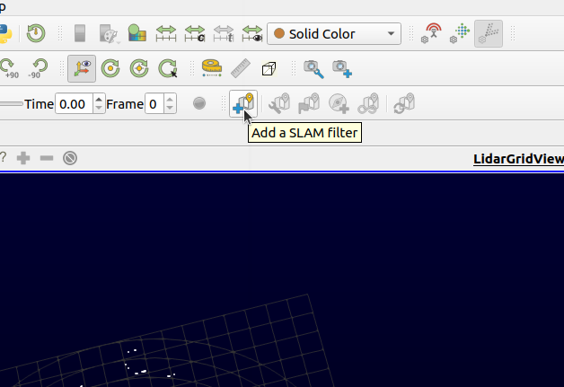

4. Tune the parameters for your use case :
  - Click on the "**Open SLAM presets settings**" button.

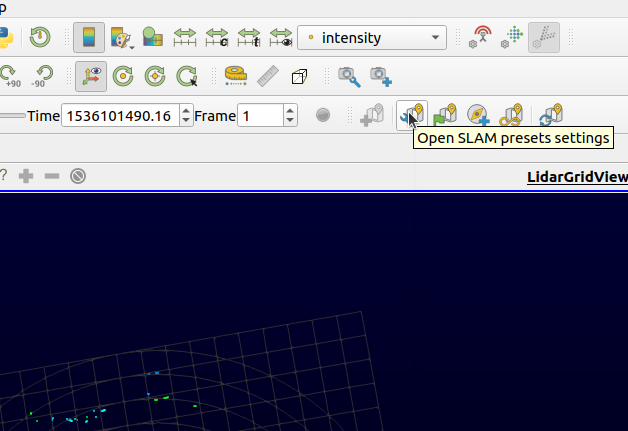

  - Select the presets corresponding to your use case in the 3 fields (environment/Lidar model/Lidar support)

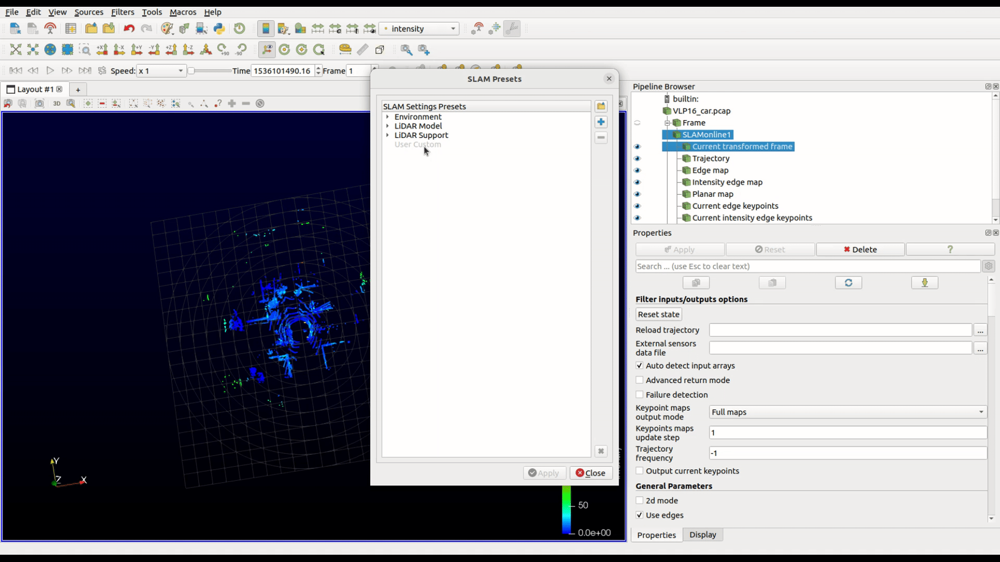

  - If you chose **Advanced mode** for LidarView : You can modify finely the SLAM parameters (see [SLAM parameters tuning section](#slam-parameters-tuning)) under **Properties** panel (bottom right).
  - Once this is done, hit **Apply**.

5. If you chose **Advanced mode** for LidarView : you can modify the display settings in the **Display** panel (bottom right) to fit your needs (e.g. modify the color and/or the size of the points).

## Main functionalities

### Reset

A button allows to reset the SLAM at a current frame :
* the SLAM is reset to initial state : pose and map. The default pose is identity and the default map is empty.
* The current frame is processed from the init pose in the init map
* the external sensor data are cleared and refilled
* the parameters are kept unchanged

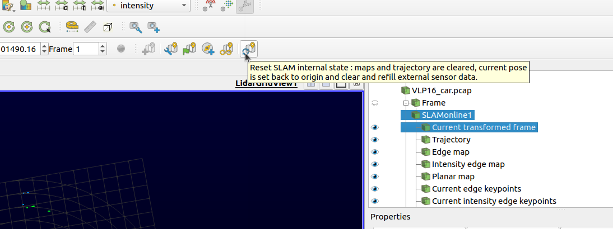

### Init

A button allows to apply an initial state (pose and map) before slamming. If a trajectory already exists, a reset action is required from the user to initialize. This reset will remove the current map.

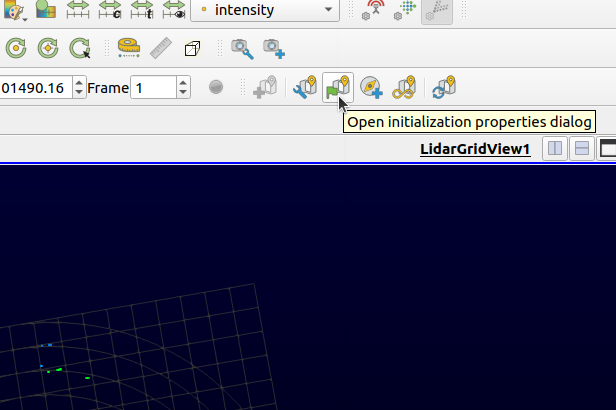
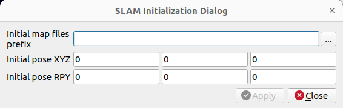

### External sensors

External sensors can be used to improve SLAM robustness solving geometric ambiguities which lead to SLAM failure cases and/or to improve SLAM accuracy, reducing the drift.

#### Data

External sensor information (wheel odometer OR IMU OR external poses) can be used in the SLAM process.
They must be provided in a CSV file and can come with a calibration matrix file (see [next section](#calibration)).
The possible fields of the CSV file are :

- *time*: Posix time, in seconds, synchronized with the Lidar frame timestamps or at least to the packets reception time -> mandatory

- *odom*: Wheel odometry, in meters -> optional

- *acc_x/acc_y/acc_z*: Acceleration from IMU, in meters/second^2 -> optional

- *w_x/w_y/w_z*: Angle velocities from IMU, in radians/second -> optional

- *x/y/z/roll/pitch/yaw*: Absolute pose measurements in meters and radians (Rz * Ry * Rx order) -> optional

#### Calibration

The calibration file must lay in the same directory as the CSV file and must be named *calibration_external_sensor.mat*. This calibration file must contain the 4x4 calibration matrix representing the transform from external poses sensor to Base frame (i.e. the tracked frame).

**Example** :
```
1 0 0 0.5
0 -1 0 2
0 0 -1 0.2
0 0 0 1
```

If the calibration file is not provided, it is set to identity (i.e. the information is supposed to be represented in **BASE** frame) and a warning is triggered.
The calibration can be estimated automatically using trustworthy trajectory portions (see Advanced functionalities).

#### Use

Click on the "**Open add external sensor dialog**".

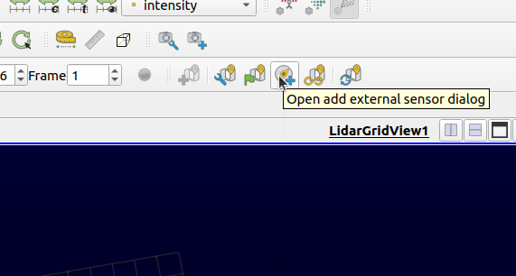
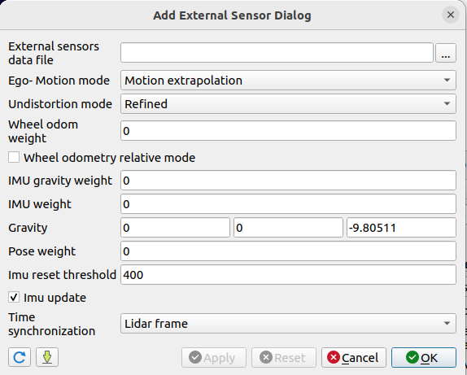

The external sensor can be used to add a constraint to the local SLAM optimization. The user must enter a weight corresponding to the external sensor used. This weight must be set experimentally knowing that it will be the confidence factor of the external sensor constraint relatively to all the keypoint matches. If the weight is null, the constraint is not added to the optimization. The constraints are :

- For the odometer a translation constraint between two successive SLAM poses or an absolute translation constraint which can be used in specific contexts such as mine exploration.
- For the IMU (when only the accelerations are provided), a gravity constraint between all frames. To do so, the acceleration of the base frame is considered as null, the acceleration measured by the IMU should only represent the gravity.
- For the external poses, a relative transform constraint between frames.

External poses (obtained by preintegrating the IMU or from another source) can also be used to :
- Estimate a prior pose : the user must choose the *External* or *External OR motion extrapolation* modes in the Ego-motion selector.
- De-skew the pointcloud : the user must choose the *External* mode in the undistortion selector.

When IMU accelerations **and** IMU angle velocities are provided along with the gravity in the world frame, those data can be preintegrated to get poses. Then, those poses can be used exactly as external poses (see features above). To perform the preintegration, a parallel graph is built between IMU and SLAM poses. This graph allows to update the biases and the integration constants. To limit the graph growth, a threshold is added to reset the graph.

**Note** : This feature needs GTSAM in order to be built (available in the superbuild).

**Warning** : the preintegration is not real time.

Finally, the user can choose which synchronization to perform (timestamps supplied by the sensor or packet reception timestamps). The time reference chosen must be the same as the one provided in the CSV file. If the packet reception is chosen, the user must be sure that their is no lag between the external sensor acquisition and the packet reception (no post-process of the data).

### Pose graph optimization

As a postprocess, the whole trajectory can be refined at some point using external informations. Those informations can be :
* Loop closure
* GNSS positions
* External trajectory

It consists in building a pose graph linking all current SLAM poses together with SLAM transforms. Then, new constraints are created between the poses. Finally, the graph is optimized (i.e. the poses are moved) so it complies with all constraints.
The computation time of this process depends on how many poses are stored in the trajectory at the current time of launch. The number of poses added to the trajectory is limited in time by the parameter **logging Time**.

**NOTE** the pose graph optimization cannot solve SLAM failures. It can only be used to reduce the drift.

To launch the pose graph optimization click on the button **Open SLAM optimize graph dialog**.
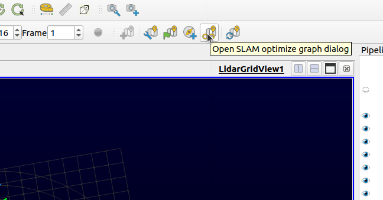
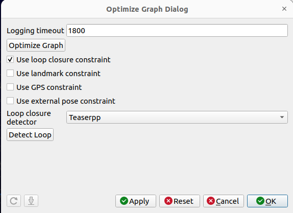

#### External sensor

For GNSS or external trajectory use, refer to [external sensors section](#external-sensors) to load the data.
Then, at any point of the trajectory, you need to check the box **Use GPS constraint** or **Use external pose constraint** and launch the optimization clicking on **Optimize graph**.

#### Loop closure

Loop closure addresses the case when some place is revisited after a period of time.
To add a loop closure constraint to the graph, it must be first detected.
For now, the loop closure detection must be triggered by the user. 2 options are available :

* **External** : A list of pairs of frames that define loop closures can be provided as a CSV file. Those pairs contain a "query frame" and a "revisited frame" which should sample the same scene from different points of view.
Here is an example of csv file:
        ```
        queryIdx,RevisitedIdx
        123,12
        456,23
        343,35
        ```
Once the CSV file is loaded, the graph can be optimized clicking on **Optimize graph**.

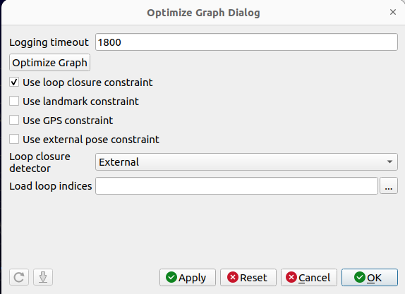

* **Teaserpp** : if teaserpp loop closure detector is chosen, a loop closure will be detected for the current frame by using teaserpp registration algorithm. The detected area will be marked in the render view and a dialog pops up to require the user how to use the detected frame.
  - **Close loop now**: use loop closure constraint to optimize graph
  - **Discard**: do not use this detected loop
  - **Keep it for later**: save detected loop indice for slam to be used later
    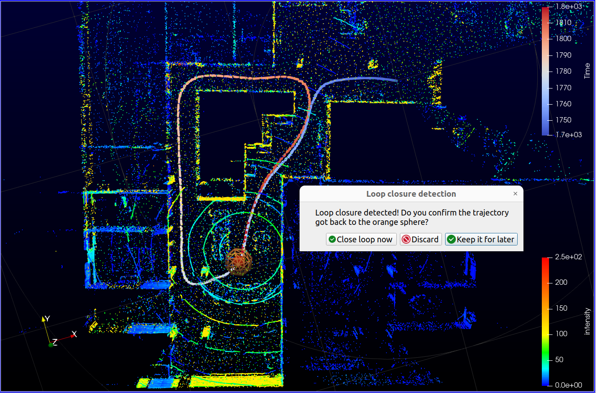

**Note**: if you chose **Advanced mode** for LidarView :
  * You can tune the loop closure parameters to fit your use case checking the box **Advanced settings** (see next picture).

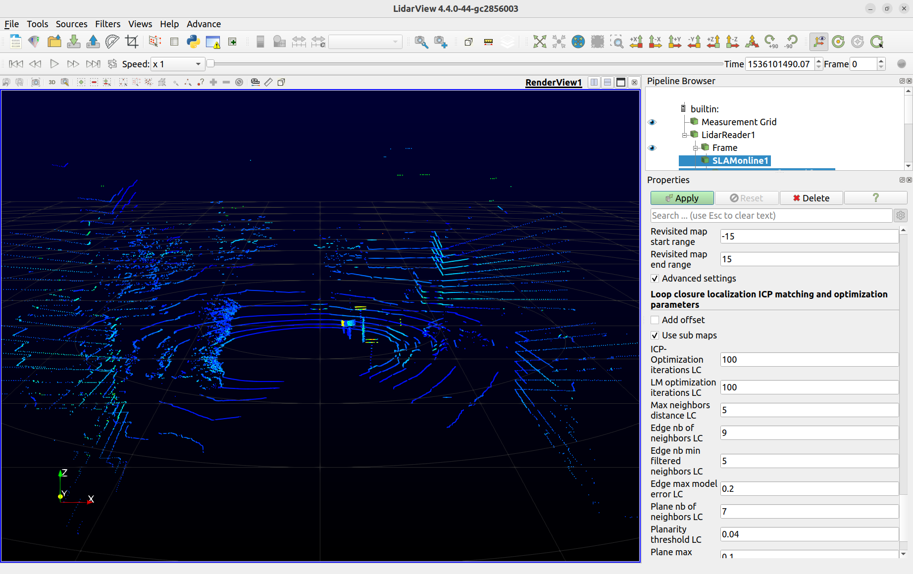

  * **Reset loop detection** button can be used to clean current loop detections, they won't be used in new graph optimization.

## Advanced functionalities

This section holds if you chose **Advanced mode** for LidarView.
Those actions are possible in the **Properties** panel (bottom right).

### Clear maps and log

A button allows to clear the current maps and the logged keypoints but keeps the external sensors state and the actual state (pose and ego-motion).

### SLAM in 2D

This checkbox allows to perform the whole process in 2D, optimizing only x, y and yaw in the world frame.

### Save/Reload trajectory

You can export a trajectory to inspect it or to avoid running the SLAM again if it fails at some point. Select the **Trajectory** output in the **Pipeline Browser** panel, then hit `Ctrl+s` and select `.csv` or `.poses` format.

You can then reload the trajectory.


This can also be used to compare or mix some trajectories acquired through different methods.

### Save keypoint maps

Keypoint maps are the local downsampled aggregations of registered keypoints from previous frames. It provides a nice light-weight insight of the reconstructed scene, and helps supervising or interpreting the SLAM behavior and results.

To save SLAM keypoints maps, select the map output you want to save in the **Pipeline Browser** panel (top right), then hit `Ctrl+s`, and choose the output format and name in the dialog window. Common pointclouds formats are `csv`, `pcd`, `las`, `ply` or `vtp`.

If you saved it in PCD format, they can be used as initial map in the SLAM (see [init section](#init))

### Save aggregated frames

If the visualization of the maps isn't enough for your application, and you need to aggregate all points from all previous frames, this is possible too, but less straightforward.

There are two ways to export aggregated scans:
- The first one allows to aggregate previous LiDAR scans into a single pointcloud that can be visualized in LidarView or Paraview. This pointcloud can be optionally downsampled then saved on disk. As this method aggregates points before saving them, the memory consumption is important and can lead to saturation.
- The second method uses a previously saved trajectory to aggregate successive scans by directly appending data to a LAS file on disk.

#### Visualize aggregated frames in viewer

*__Note__: Be careful, the aggregation of ALL previous points may represent a huge pointcloud! With ~1 000 000 points per second and the associated measurements (intensity, time, laser ID, etc.), each minute of recording represents several GB of data! Depending on your machine specifications, this may not fit into memory and lead to an annoying crash of the application.*

1. Instantiate an **Aggregate Points From Trajectory** filter using **Frame** as point cloud entry, and the output SLAM **Trajectory** for trajectory entry. Depending on the chosen number of frames, the transformation and aggregation of pointclouds may be long. When it succeeds, you should now see all points being correctly registered. All the frames or a chosen range of frames can be aggregated. For example, if you want to aggregate points from frame #100 to frame #500, but using only points from 1 frame out of 3, specify First Frame = 100, Last Frame = 500, Frame Stride = 3. The processed frames can be manually chosen with a **Aggregate Points From Trajectory Online** filter instead of **Aggregate Points From Trajectory**. By default, the points are filtered by a voxel grid defined by a leaf size.
If the colors look strange, check that you are displaying the `intensity` array in the main toolbar.


This first step allows you to visualize all the aggregated points in LidarView. If you want to save it on disk, please follow this additional step:

2. As usual, save aggregated frames by selecting the desired output **Aggregate Points From Trajectory**, hit `Ctrl+s`, and choose the output format (LAS, CSV, PLY, VTP) and name.

#### Directly aggregate all points in a LAS file

This method directly appends points to a LAS file on disk, which has the advantage to avoid saturating the RAM.

1. Instantiate a **Aggregate Points From Trajectory** filter using the **Frame** as point cloud entry, and the output SLAM **Trajectory** for trajectory entry.

2. Save the output of the **Aggregate Points From Trajectory** by hitting `Ctrl+s`, selecting the **LAS point cloud file** format, and specifying the output file name before validating. A new dialog will appear to configure the LAS file writer, where you can modify the parameters to your needs. For example, if you want to aggregate points from frame 100 to 500, but using only points from 1 frame out of 3, specify *First Frame = 100*, *Last Frame = 500*, *Frame Stride = 3*.
The export can be quite long (from a few seconds to several minutes) as each specified frame needs to be processed.

## SLAM parameters fine tuning

*__Note__: To see all parameters, make sure that the advanced properties of the SLAM filter are enabled by toggling the little gear wheel in the **Properties** panel.*

### Use case context

The default SLAM parameters should be a good compromise to run the SLAM for most outdoor urban environments with the LiDAR sensor mounted on top of a vehicle but are not necessarily adapted to your use case. Principal factors which impact the parameter settings are :
* LiDAR support :
  * Are there occlusions?
  * Is there high frequency motion?
  * Is there a lot of overlap between frames?
* Environment
  * Is it structured?
  * Is motion fast in this environment?
  * Is it large/narrow?
* LiDAR model :
  * How many points per frame does it have?
  * What is the field of view?
  * What is the accuracy for close/far points?
  * What is the accuracy on a plane?

The presets (see [first section](#using-slam-in-lidarview)) can help you tune the SLAM to your specific use case.
If you want to inspect relative parameters check the [preset files](../UserInterface/Resources/Presets/).

To adapt the field of view, you can play with the parameters :
* **Min distance to sensor** : to remove closest points in case of occlusion or points not trustworthy enough (e.g a human following the Lidar).
* **Max distance to sensor** : to remove points that are not trustworthy enough
* **Min/Max azimuth angle** : to remove occlusions

### Goal

If you don't want to map but you want to localize in a previously acquired map, you can use the localization mode. To do so, modify the parameter **Mapping mode** to forbid the update of the map or to only add points that have never been seen, keeping initial map points. This last mode can be useful in case of a mid-term dynamic scene

### Increasing the processing speed

To increase the processing speed, consider also tweaking these parameters:

- **Number of threads**: Maximum number of threads used for parallel processing. Allowing several threads (about 4) increases SLAM processing speed, skipping less frames, and thus improving result.

- **Keypoints maps update step**: If you don't need the map display to be refreshed at each new frame, you should consider increasing this value. Setting it to 10 will only update maps every 10th frame (1 second at 600 rpm), which is far enough for a nice visualization. This will save some output conversion time.

- **LidarView play speed**: This is not specific to the SLAM filter, but LidarView is controlling the playback speed of the LiDAR recording. It can be set from the VCR toolbar. For example, *Speed = x1* will play at real speed, *Speed = x3* will play 3 times faster. If the SLAM algorithm isn't fast enough to process all incoming frames, it will drop some of them. If your LiDAR is slowly moving or with smooth motion, this not a problem. However, if it skips too many frames compared to the LiDAR motion, consider choosing the *Speed = All Frames*, which will play as fast as possible but ensuring that all frames are processed.

### Accuracy/performances compromise

The following parameters can be tuned to find a compromise between computation time and result accuracy :

* **Maximum keypoints number** : the maximum number of points that are processed at each frame. Each specific type keypoints are downsampled uniformly to reach this number.
* **Ratio of points** : One point over N will be processed. This can be tuned in case of very dense LiDAR sensors to limit computation time.
* **Submap extraction mode** : one mode or the other can lead to different performance results depending on the Lidar orientation relatively to the motion.
* **X map resolution** : the density of the map can be increased for better accuracy in some cases at the cost of an increase of computation time. **Warning**: a very dense map can lead to a loss of accuracy because of local minima issues.

## SLAM evaluation

### Confidence estimators

Some confidence metrics have been implemented to evaluate the SLAM result:
- Overlap estimation (between 0 and 1)
- Motion limits compliance relatively to input thresholds
- Error standard deviation based on covariance analysis
- Number of keypoints matched

To observe those metrics, you have to enable the *Advanced return mode* in the filter parameters. The trajectory filter output should now contain the metrics data and you can observe it as a color on trajectory points. Then, one interesting method is to display the metrics in another render view :
- Click on the icon "Split horizontal axis"
- In the new render view, choose *Line chart view*
- Select the output of the SLAM filter named **Trajectory** (click on the eye at the left of the Trajectory object). You should see some curves representing the metrics.
- In the **Display** pannel (bottom right), when working on the new renderview and having selected the Trajectory object, you should be able to select the metrics you want to observe.


### Failure detection

Another feature has been developped to fuse the confidence estimators to trigger a failure. The failure cases that can be detected include :
- Map doubling, due to an isolated high motion, a temporal big occlusion or to quick scene change (e.g. door crossing)
- Lack of degree of liberty (e.g. corridor case)
- Divergence due to a combination of external factors

To enable this feature, you should turn on *Failure detection* in the SLAM filter parameters.

In case a failure is detected, the filter enters a recovery mode. This mode fixes the map and the trajectory to an older state and automatically updates some of the parameters to allow a bigger motion and a longer computation time. The user should go back to a previous pose to try to be relocalized and get out of this mode to go on with his acquisition without breaking the map. He can also update the parameters for the specific trajectory part that has gone wrong.

**/!\ Warning** : for now, going back to a previous pose includes orientation, so, mind your acquisition direction when looking for recovery.

If this feature is disabled during recovery, the state is reset as before the recovery mode has been triggered. Therefore, if you see the SLAM is relocalized but the recovery mode is still on (the confidence thresholds have not been reached), you can disable the failure detection and reenable it later on to force going out of the recovery mode.

**/!\ Warning** : in recovery mode, some of the parameters displayed in the filter interface are not excatly the ones used :
* **Map update mode**
* **Ego-motion mode**
* **Undistortion mode**
* **Maximum number of ICP iterations**
* **Maximum distance between nearest neighbors**
* **Initial saturation distance**
*
 If you change one of these parameters during the recovery mode, it will be reset as before the recovery mode after relocalization. Therefore, again, the parameters used will not be the ones displayed in the filter interface.